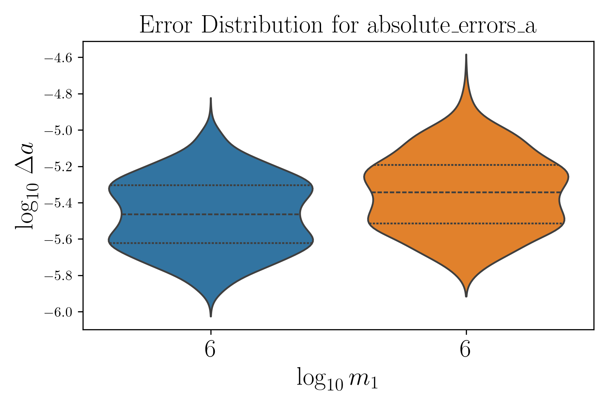
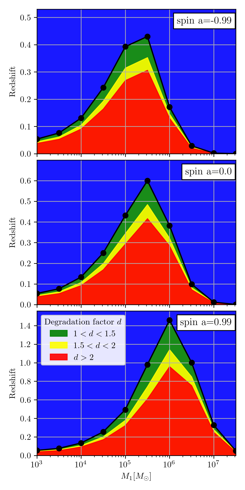

# EMRI Figures of Merit (FoMs) Computation

This repository contains codes for computing Figures of Merit (FoMs) related to Extreme Mass Ratio Inspirals (EMRIs) and Intermedia Mass Ratio Inspirals (IMRIs).




TODO:
- Create requirements for parameter estimation and upload everything in SO3 https://gitlab.in2p3.fr/LISA/lisa-fom/-/tree/develop?ref_type=heads
- Quadrupole moment https://arxiv.org/abs/gr-qc/0612029 , mapping in eq 43 of https://arxiv.org/pdf/gr-qc/0510129
- Check Fisher Information Stability and update with Shubham folder
- Update response to newest one (Maybe? we can also keep the old response)
- Check installation instructions

## Installation Instructions

Follow these steps to set up the environment and install the necessary packages. The installation is meant to be run on GPUs with CUDA compiler `nvcc`.

0) [Install Anaconda](https://docs.anaconda.com/anaconda/install/) if you do not have it.

1) Create a virtual environment. **Note**: There is no available `conda` compiler for Windows. If you want to install for Windows, you will probably need to add libraries and include paths to the `setup.py` file.

### Fast EMRI Waveforms

Below is a quick set of instructions to install the Fast EMRI Waveform (FEW) package.

Create an environment for the figures of merit
```sh
conda create -n fom -c conda-forge -y gcc_linux-64 gxx_linux-64 wget gsl lapack=3.6.1 hdf5 numpy Cython python=3.12 pandas fortran-compiler
conda activate fom
pip install tabulate markdown pypandoc scikit-learn healpy lisaanalysistools seaborn corner scipy tqdm jupyter ipython h5py requests matplotlib eryn
```

Locate where the `nvcc` compile is located and add it to the path, in my case it is located in `/usr/local/cuda-12.5/bin/`
```sh
pip install cupy-cuda12x GPUtil jax[cuda]
export PATH=$PATH:/usr/local/cuda-12.5/bin/
```

Check the version of your compiler by running `nvcc --version` and install the corresponding FEW cuda version for running on GPUs [temporary workaround until the repo is merged back into the toolkit]:
```sh
git clone https://github.com/znasipak/FastEMRIWaveforms-Soton-Hackathon-2025.git
cd FastEMRIWaveforms-Soton-Hackathon-2025/
git checkout PaperProduction
pip install .
cd ..
```

Test the installation device by running python
```python
import few
few.get_backend("cuda12x")
```

### Fisher Information package

Install the Fisher information package
```sh
cd StableEMRIFisher-package/
pip install .
cd ..
```

### Install `lisa-on-gpu` for LISA Response
Install the response
<!-- ```sh
git clone https://github.com/mikekatz04/lisa-on-gpu.git
cd lisa-on-gpu
python scripts/prebuild.py
pip install .
``` -->
```sh
cd lisa-on-gpu
python setup.py install
cd ..
```

Verify `lisa-on-gpu` Installation by opening a Python shell and run:

```python
from fastlisaresponse import ResponseWrapper
```

### Test waveform and response
```
python -m unittest test_waveform_and_response.py 
cd pipeline
python pipeline.py --M 1e6 --mu 1e1 --a 0.5 --e_f 0.1 --T 1.0 --z 0.1 --repo test --psd_file TDI2_AE_psd.npy --dt 10.0 --use_gpu --N_montecarlo 1 --device 0 --repo test
```

## Running the pipeline

Place yourself in the folder pipeline and run the pipeline on GPUs
```
cd pipeline
python run_pipeline.py
```

Inside the `run_pipeline.py` you can modify the thresholds for the science objectives, the sources and the number of randomization over sky and phase.

You can also run the pipeline in the background with `nohup python run_pipeline.py > logpipeline.log &`
